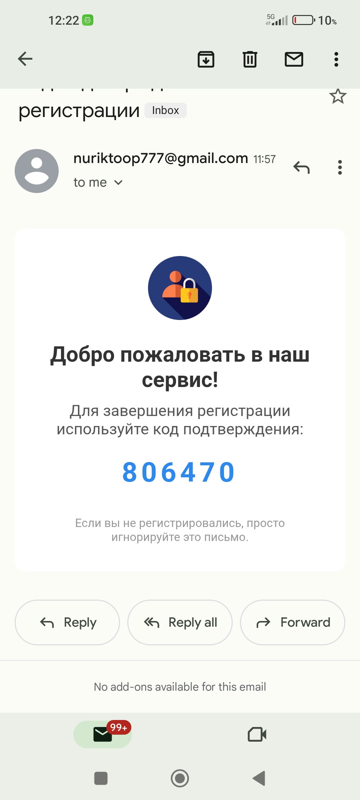
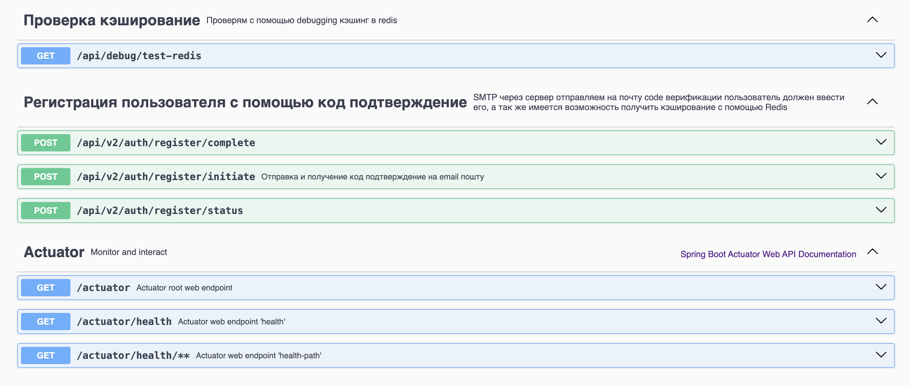

# 📧 Registration with Email Verification
## Проект для регистрации пользователей с подтверждением email через код верификации, защитой от спама и кешированием данных.

## 🛠 Технологии и зависимости
Backend Framework
Spring Boot 3.5.4 - основной фреймворк

Spring Web - REST API

Spring Data JPA - работа с базой данных

Spring Security - аутентификация и авторизация

Spring Validation - валидация данных

Spring Mail - отправка email

База данных
PostgreSQL - основная реляционная БД

H2 Database - in-memory БД для разработки (опционально)

Кеширование
Redis - распределенное кеширование

Spring Data Redis - интеграция с Redis

Валидация и утилиты
Lombok - автоматическая генерация кода

Jakarta Validation - аннотации валидации

Документация
Springdoc OpenAPI - Swagger документация

Email
JavaMailSender - отправка SMTP писем

## 📋 Требования
Системные требования
Java 17+

Maven 3.6+

Redis 6+

PostgreSQL 12+ (или H2 для разработки)

## Порты
8080 - Spring Boot приложение

6379 - Redis

5432 - PostgreSQL

3000 - Swagger UI


# 🚀 Быстрый запуск
1. Клонирование репозитория

```markdown
https://github.com/NuRS7/RegistrationWithCode.git
cd RegistrationWithCode
```
2. Запуск Redis
```markdown
# macOS с Homebrew
brew install redis
brew services start redis

# Linux
sudo apt install redis-server
sudo systemctl start redis

# Windows
# Скачать Redis from https://redis.io/download
```
3. Настройка базы данных
```markdown
# Для разработки (H2) - ничего делать не нужно
# Для Production (PostgreSQL):
createdb registration_db
```

4. Создайте application.properties или используйте environment variables:
```markdown
# База данных (раскомментируйте нужную)
spring.datasource.url=jdbc:h2:mem:testdb
spring.datasource.username=sa
spring.datasource.password=

# Или для PostgreSQL
# spring.datasource.url=jdbc:postgresql://localhost:5432/registration_db
# spring.datasource.username=postgres
# spring.datasource.password=yourpassword

# JPA
spring.jpa.hibernate.ddl-auto=create-drop
spring.jpa.show-sql=true
spring.jpa.properties.hibernate.dialect=org.hibernate.dialect.H2Dialect

# Redis
spring.data.redis.host=localhost
spring.data.redis.port=6379
spring.data.redis.timeout=5000

# Email (настройте ваши SMTP данные)
spring.mail.host=smtp.gmail.com
spring.mail.port=587
spring.mail.username=your-email@gmail.com
spring.mail.password=your-app-password
spring.mail.properties.mail.smtp.auth=true
spring.mail.properties.mail.smtp.starttls.enable=true

# Логгирование
logging.level.com.auth.registration=DEBUG
logging.level.org.springframework.data.redis=INFO
```
5. Сборка и запуск
```markdown
# Сборка
mvn clean package

# Запуск
java -jar target/registration-with-code-0.0.1-SNAPSHOT.jar

# Или запуск через Maven
mvn spring-boot:run
```
6. Проверка работы
Откройте в браузере:

Swagger UI: http://localhost:8080/swagger-ui.html

H2 Console: http://localhost:8080/h2-console (если используете H2)

# 📊 API Endpoints
## 🔐 Аутентификация
- POST /api/v2/auth/register/initiate - Начало регистрации

- POST /api/v2/auth/register/complete - Завершение регистрации с кодом

- POST /api/v2/auth/register/status - Проверка статуса регистрации

## 📧 Email верификация
- POST /api/email/send-code - Отправка кода верификации

- POST /api/email/verify-code - Проверка кода верификации

## 🎯 Утилиты
- GET /api/debug/test-redis - Тест Redis подключения

- GET /api/health - Проверка здоровья приложения

## 🔧 Настройка Email
Для Gmail
Включите двухфакторную аутентификацию

Сгенерируйте App Password: https://myaccount.google.com/apppasswords

Используйте App Password вместо обычного пароля

## Пример конфигурации Gmail:
```markdown
spring.mail.host=smtp.gmail.com
spring.mail.port=587
spring.mail.username=your.email@gmail.com
spring.mail.password=your-16-digit-app-password
spring.mail.properties.mail.smtp.auth=true
spring.mail.properties.mail.smtp.starttls.enable=true
```

## ⚙️ Конфигурация Redis
```markdown
# Проверить статус
redis-cli ping
# Должен ответить: PONG

# Посмотреть данные
redis-cli keys *
```

## Redis мониторинг
```markdown
# Мониторинг в реальном времени
redis-cli monitor

# Информация о сервере
redis-cli info
```

## 🛡️ Security Configuration
Приложение использует кастомную конфигурацию безопасности:
```markdown
@Configuration
public class SecurityConfig {
    @Bean
    public SecurityFilterChain filterChain(HttpSecurity http) throws Exception {
        return http
            .csrf(csrf -> csrf.disable())
            .authorizeHttpRequests(auth -> auth
                .anyRequest().permitAll()
            )
            .build();
    }
}
```
## 📦 Структура проекта
```markdown
src/
├── main/
│   ├── java/com/auth/registration/
│   │   ├── controller/     # REST контроллеры
│   │   ├── service/        # Бизнес-логика
│   │   ├── repository/     # JPA репозитории
│   │   ├── model/          # Сущности БД
│   │   ├── dto/           # Data Transfer Objects
│   │   ├── config/        # Конфигурационные классы
│   │   └── exception/     # Кастомные исключения
│   └── resources/
│       ├── application.properties
│       └── static/        # Статические файлы
└── test/                  # Тесты
```
## 🔄 Environment Variables

| Переменная   | Описание         | По умолчанию              |
|--------------|------------------|---------------------------|
| `DATABASE_URL` | URL базы данных  | `jdbc:postgresql://localhost:5432/registration_db`      |
| `REDIS_HOST`   | Redis хост       | `localhost`               |
| `REDIS_PORT`   | Redis порт       | `6379`                    |
| `SMTP_HOST`    | SMTP сервер      | `smtp.gmail.com`          |
| `SMTP_PORT`    | SMTP порт        | `587`                     |

## 📸 Скриншоты

### 🔑 Получение кода верификации


### 📊 Панель управления


## 👨‍💻 Автор
- Nursultan Yerbakytuly — [GitHub](https://github.com/NuRS7) | [LinkedIn](https://www.linkedin.com/in/nursultan-yerbakytuly-900339352/)
  


